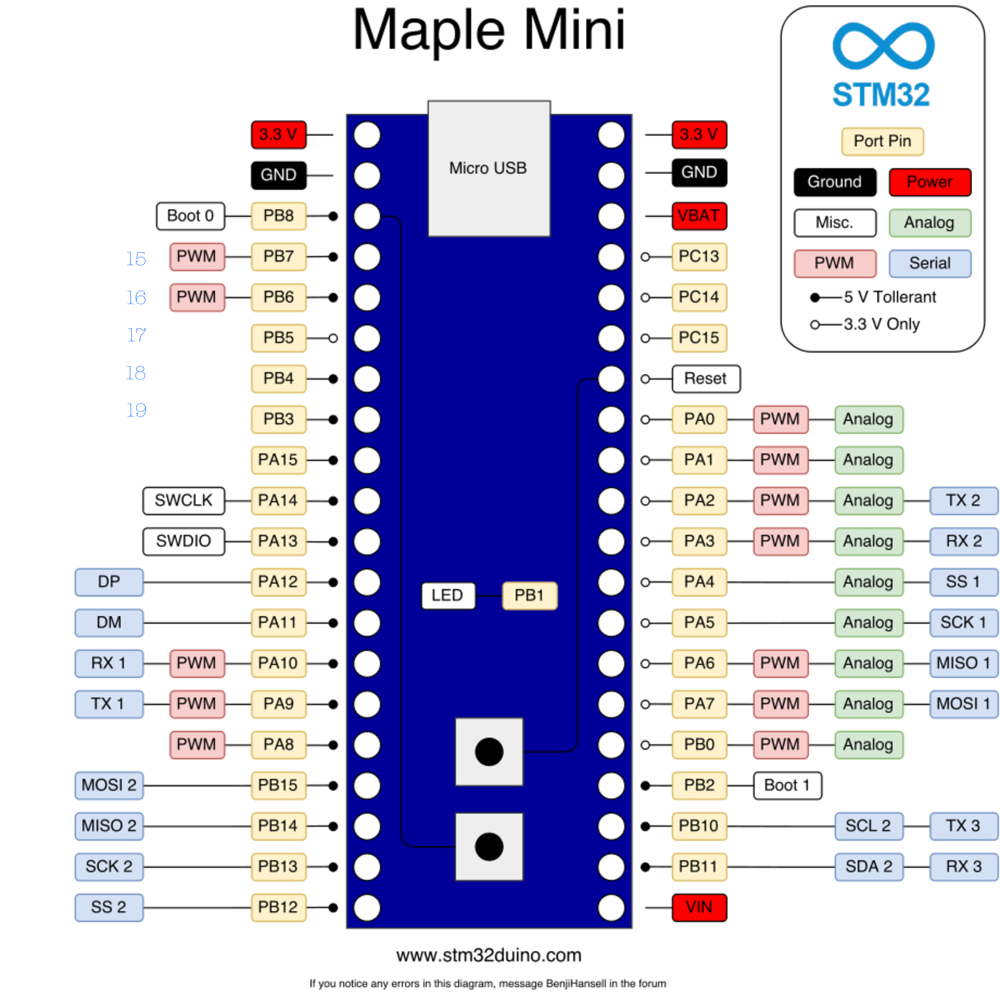
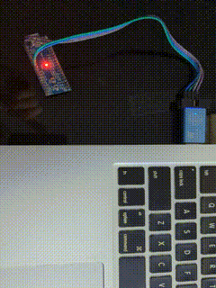

This is a simple Arduino-compatible adjustable timer for [STM32F103C8T6](https://docs.platformio.org/en/latest/boards/ststm32/maple_mini_origin.html) based Mapple Mini.

- 
Board pin out.

## Usage

Push a button to increase the interval.
 Keep it pushed for exact time you want to increase the interval.

- 
Demo

## Flashing & Debugging

I have used ST-Link to flash it, I guess DFU could be used as well.
## Requirements
- [Install Platform.io](https://platformio.org/install/ide?install=vscode)